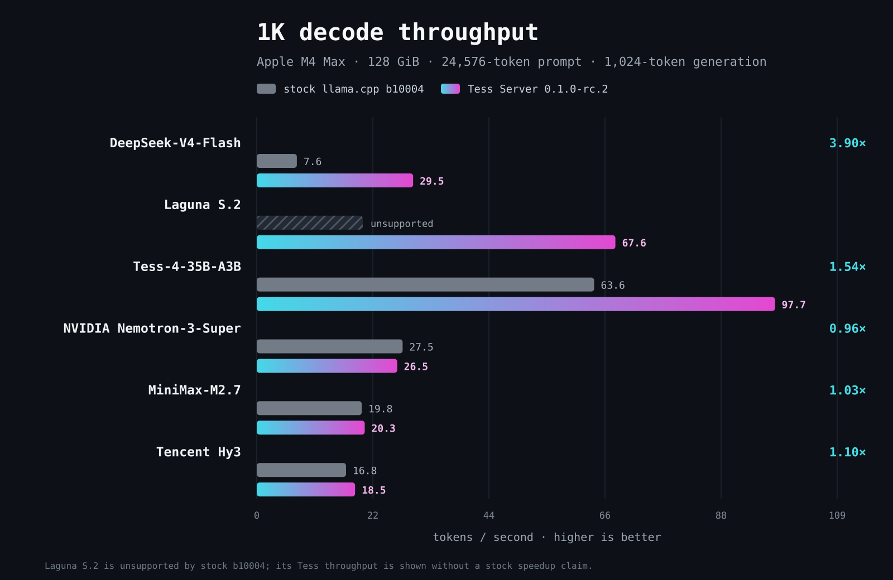
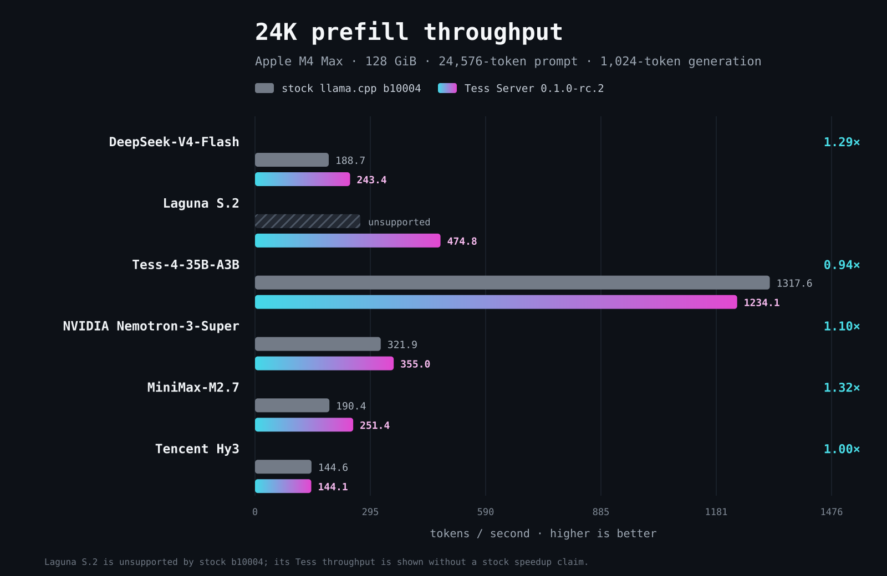

# Tess Server

```text
    ╷ ╷ ╷ ╷ ╷ ╷
  ┌─┴─┴─┴─┴─┴─┴─┐
 ─┤             ├─
 ─┤   T E S S   ├─
 ─┤ S E R V E R ├─
 ─┤             ├─
  └─┬─┬─┬─┬─┬─┬─┘
    ╵ ╵ ╵ ╵ ╵ ╵
```

**Run frontier-scale open models locally on Apple Silicon.**

Tess Server turns one Mac into a serious inference machine. It serves 300B-class open mixture-of-experts models at agent-scale context depths, decodes up to **3.90x faster than stock llama.cpp** on the same hardware, and runs model architectures stock llama.cpp cannot load at all — behind a local OpenAI-compatible API, with nothing leaving your machine.

No cloud. No per-token cost. No telemetry, update checks, or implicit downloads. Your models, your prompts, your Mac.

## Quick start

```bash
npm install -g @trinity-cloud/tess-server
tess-server doctor
tess-server
```

One package, no external dependencies: no Homebrew, no Python, no separate engine install. The guided terminal app discovers GGUF models on internal and attached storage, verifies them against versioned profiles, and serves them with managed, qualified settings. Model weights are not bundled; you obtain and store GGUF files under their respective licenses.

## The numbers

We measured the packaged Tess Server engine against official stock llama.cpp `b10004` on one Apple M4 Max with 128 GiB unified memory: identical deterministic recall workload, exactly 24,576 prompt tokens and 1,024 generated tokens — the depth a real coding-agent request actually occupies, not a toy benchmark. Temperature zero, one slot, no prompt cache, every Tess run bracketed by two stock runs on the same thermal state.



- **DeepSeek-V4-Flash (284B-A13B)** decodes at **29.47 tok/s where stock manages 7.56** — **3.90x** — and prefills 1.29x faster.
- **Tess-4-35B-A3B** decodes at **97.66 tok/s**, **1.54x** stock.
- **MiniMax-M2.7 (230B-A10B)** prefills **1.32x** faster.
- **Tencent Hy3 (298.8B)** decodes **1.10x** faster.



And the results we did not win: stock is 6% faster on Tess-4 prefill, 4% faster on Nemotron decode, and Hy3 prefill is a tie. We publish those too, in the same charts, because a benchmark that only reports victories is an advertisement. Every number traces to an evidence record with raw [JSON](docs/assets/performance/stock-vs-tess-data.json) and [CSV](docs/assets/performance/stock-vs-tess-data.csv) data; see [Performance and methodology](docs/performance.md) for the complete table, protocol, and correctness scope.

## Models stock llama.cpp cannot run

In the six-profile 0.1.3 comparison set, two models did not load in official stock llama.cpp at all — the architecture support lives in the Tess Server engine:

- **Laguna S.2 (118B-A8B)** with its DFlash speculative drafter. The July 21 benchmark of the initial publisher artifact measured **67.58 tok/s versus 13.45 — 5.03x** against a reference build patched only for model support at the same 24K-token depth. The refreshed publisher GGUF profiled in Tess Server 0.1.1 has passed runtime qualification but is not represented by that historical throughput result.
- **Tencent Hy3 (298.8B)**, a 192-expert mixture-of-experts model served whole on a single 128 GiB Mac.

Depth is the other frontier. MiniMax-M2.7 serves its **full 196,608-token trained context** on one M4 Max, the original DeepSeek-V4-Flash profile and Laguna S.2 are profile-qualified to 256K, and Tess-4 is qualified through a 512K YaRN target-only tier.

## Lossless speculative decoding, packaged

Six of the ten profiles ship with managed speculative decoding — DFlash for Laguna and Muse Glimmer, DSpark for both exact DeepSeek-V4-Flash artifact generations, and multi-token-prediction for Tess-4 and Hy3 — pre-tuned, verified, and on by default where it wins. This is the difference between reading your model's output and waiting for it.

Speed never trades away correctness: **every accepted draft token is still verified by the target model.** Where speculation does not help, the profile simply does not use it.

## A guided launcher, not a flag zoo

Large-model serving on a Mac has real failure modes: out-of-memory panics, silently wrong context windows, mismatched draft files. Tess Server's open-source TUI manages them instead of handing you forty flags:

- Discovers profiled and unprofiled GGUF models under `~/models`, `~/Models`, and `models` or `Models` folders on attached volumes, plus any folder you add from the TUI or with `--model-root`.
- Verifies model files against hash-bound profiles before the first launch — a mismatch is a startup error, not a warning.
- Keeps every configured context choice selectable. Qualified tiers carry the verified claim; experimental or untested tiers display an explicit warning while memory-critical settings remain managed.
- Groups nearby projector and draft/MTP artifacts under unprofiled primary models, with detected defaults and a complete generic configuration screen for clearly labeled best-effort launches.
- Shows the effective engine command before launch — nothing is hidden.
- Starts, monitors, and cleanly shuts down a loopback-only OpenAI-compatible server, so the engine is never left running in the background.

When a 128 GiB profile needs a larger macOS GPU-wired memory limit, the TUI prints the exact one-time-per-boot command. Tess Server never runs it, never requests administrator privileges, and never changes system settings itself.

Profile support is exact-file specific. Other primary GGUF files are shown as **Unprofiled**, use conservative generic defaults, and carry no compatibility, verification, memory, correctness, or performance claim. Direct engine invocation remains available as the unrestricted expert escape hatch.

## Supported profiles

The 0.1.4 release includes ten profiles. New exact-file profiles cover Qwen3.5-122B-A10B, Inkling-Small, Muse Glimmer 30B, and the archived DeepSeek-V4-Flash-0731 artifact set. Their verified defaults stop at the recorded qualification depths; larger configured contexts remain selectable with an explicit untested warning.

| Model | Quantization | GGUF size | Memory class | Default context | Available context choices |
|---|---|---:|---:|---:|---|
| **Laguna S.2** | Q4_K_M + BF16 DFlash | 63.6 GiB + 2.1 GiB draft | 128 GiB | 16K | 8K, 16K, 32K, 64K, 128K, 256K |
| **Tess-4-35B-A3B** (Qwen3.6-35B-A3B base) | Tess Q8/Q4 build | 35.2 GiB | 64 GiB | 128K | 32K, 64K, 128K, 256K, 512K; untested 1M |
| **Qwen3.5-122B-A10B** | Q4_K_M | 71.3 GiB | 128 GiB | 16K | 8K, 16K; untested 32K, 64K, 128K, and 256K |
| **Inkling-Small** | UD-IQ3_XXS | 91.2 GiB | 128 GiB | 16K | 8K, 16K; untested 32K through 1M |
| **Muse Glimmer 30B** | K-Quant 17GB + DFlash | 15.6 GiB + 1.5 GiB draft | 64 GiB | 16K | 8K, 16K; untested 32K, 64K, and 128K |
| **NVIDIA Nemotron-3-Super-120B-A12B** | UD-Q4_K_M | 76.9 GiB | 128 GiB | 32K | 32K, 64K, 128K, 256K; experimental 512K and 1M |
| **DeepSeek-V4-Flash** | UD-IQ3_XXS + DSpark | 95.9 GiB + 10.5 GiB draft | 128 GiB | 32K | 4K, 8K, 16K, 32K, 64K, 128K, 256K; untested 512K and 1M |
| **DeepSeek-V4-Flash-0731** | UD-IQ3_XXS + DSpark | 95.9 GiB + 10.5 GiB draft | 128 GiB | 8K | 4K, 8K with DSpark; target-only 16K, 32K, 64K, 128K, 256K; untested 512K and 1M |
| **MiniMax-M2.7** | UD-IQ4_XS | 101 GiB | 128 GiB | 70K | 32K, 64K, 70K, 96K, 128K, 160K, 192K |
| **Tencent Hy3** | IQ2_M | 93.1 GiB | 128 GiB | 32K | 8K, 16K, 32K, 48K; experimental 64K |

See [Supported models](docs/models.md) for context and memory guidance.

## Private by construction

Privacy here is not a policy statement — it is how verified profile launches are built:

- The server binds to `127.0.0.1` only. Managed launches are never exposed to your LAN.
- No telemetry, no update checks, no cloud fallback, no implicit downloads.
- No prompt or generation logging by Tess Server.
- Browser UI and built-in agent/tool surfaces are disabled at launch.
- Optional bearer authentication backed by a private local key file — the key value is never stored in settings.
- Model files are checksum-verified before a profile is labeled verified.

If your work cannot leave your machine — security research, regulated code, client data — this is the deployment model that makes the promise checkable.

Tess Server is an inference server, not a security boundary for untrusted model files or untrusted local users. Only load models you trust and have the right to use.

## Connect a client

Press `c` on the model list to set the port (default `8787`), API model name (default `local-llama-server`), and optional bearer authentication. Press `e` on model details for that profile's expert options.

The default endpoint speaks the OpenAI API — point any existing client, agent, or IDE integration at it:

```text
http://127.0.0.1:8787/v1
```

```bash
curl http://127.0.0.1:8787/v1/chat/completions \
  -H 'Content-Type: application/json' \
  -d '{
    "model": "local-llama-server",
    "messages": [{"role": "user", "content": "Hello from my Mac"}]
  }'
```

Streaming, tool calls, and standard chat completions are supported. If bearer authentication is enabled, add the conventional `Authorization: Bearer ...` header.

## Requirements

- Apple Silicon Mac (`arm64`).
- macOS 15 or newer by deployment target. The current packaged qualification host is macOS 26.2; macOS 15.x remains compatibility-targeted until tested on a physical Sequoia installation.
- Node.js 22 or newer.
- Sufficient unified memory for the selected profile.
- Locally stored GGUF weights.

## Command-line use

The interactive TUI is the recommended entry point. Scriptable commands are also available:

```bash
tess-server profiles
tess-server models --model-root /Volumes/Models
tess-server verify --profile PROFILE_ID --model /path/to/model.gguf
tess-server serve --profile PROFILE_ID --model /path/to/model.gguf --context 32768
tess-server doctor
tess-server engine -- --help
```

See [Running Tess Server](docs/running.md) for complete examples and client guidance.

## Licensing

This repository has a deliberate split-license boundary:

- The TypeScript/Ink TUI and npm tooling are open source under the [MIT License](LICENSE-TUI.md).
- The bundled Tess Server engine sidecar is governed by the [Tess Server Engine License Agreement](LICENSE.md).
- Third-party components retain their original licenses, listed in [Third-party notices](THIRD_PARTY_NOTICES.md).
- Model weights are not included and remain governed by their own licenses.

Tess Server is built on the MIT-licensed [llama.cpp](https://github.com/ggml-org/llama.cpp) and ggml foundations. Trinity Cloud's proprietary engine modifications are not part of the open-source TUI license.

## Documentation

- [Documentation index](docs/index.md)
- [Supported models](docs/models.md)
- [Running Tess Server](docs/running.md)
- [Tess-4 context qualification](docs/tess-4-context-qualification.md)
- [Laguna context qualification](docs/laguna-context-qualification.md)
- [Performance and methodology](docs/performance.md)
- [Brand marks](docs/branding.md)

---

Built by [Trinity Cloud, Inc.](https://trinitycloud.ai).
