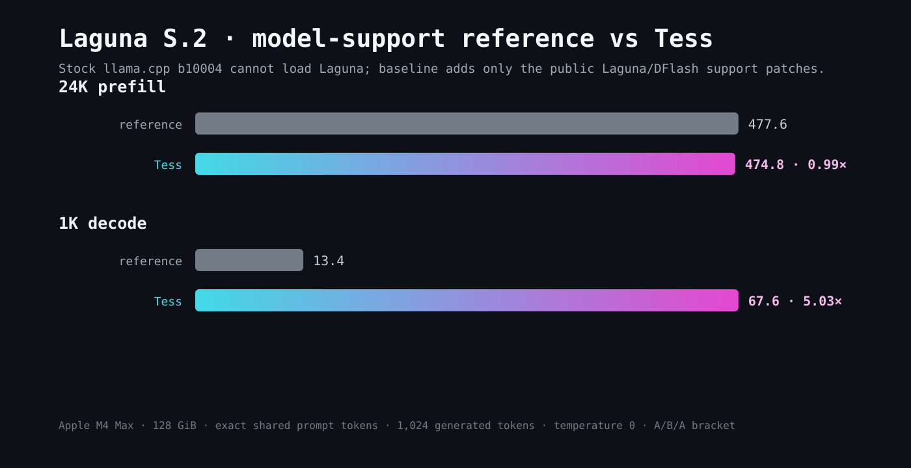

# Performance and methodology

This page reports the July 21, 2026 comparison between the packaged Tess Server `0.1.0-rc.2` engine and official stock llama.cpp `b10004` (`7cbd61002`). It describes measured product behavior without disclosing proprietary implementation details. The Laguna row uses the initial publisher GGUF profiled in 0.1.0; the refreshed publisher artifact profiled in 0.1.1 is not represented by these historical throughput figures.

## Results

All values are tokens per second. Stock is the mean of the two baseline phases surrounding Tess. A ratio above 1.00x favors Tess.

| Model | Stock prefill | Tess prefill | Ratio | Stock decode | Tess decode | Ratio |
|---|---:|---:|---:|---:|---:|---:|
| **DeepSeek-V4-Flash** | 188.75 | 243.41 | **1.29x** | 7.56 | 29.47 | **3.90x** |
| **Laguna S.2** | unsupported | 474.80 | — | unsupported | 67.58 | — |
| **Tess-4-35B-A3B** | 1,317.61 | 1,234.10 | 0.94x | 63.57 | 97.66 | **1.54x** |
| **NVIDIA Nemotron-3-Super** | 321.87 | 354.98 | **1.10x** | 27.49 | 26.48 | 0.96x |
| **MiniMax-M2.7** | 190.45 | 251.36 | **1.32x** | 19.78 | 20.35 | **1.03x** |
| **Tencent Hy3** | 144.57 | 144.05 | 1.00x | 16.83 | 18.53 | **1.10x** |

The sanitized source data is available as [JSON](assets/performance/stock-vs-tess-data.json) and [CSV](assets/performance/stock-vs-tess-data.csv).

## Laguna disclosure

Official stock llama.cpp `b10004` cannot load Laguna S.2, so the headline charts mark it unsupported and make no stock speedup claim. For engineering context, we also measured a support-only reference made from `b10004` plus the Laguna/DFlash architecture-support changes, using the same target, drafter, settings, prompt, and A/B/A protocol. That reference measured 477.59 tok/s prefill and 13.45 tok/s decode; Tess measured 474.80 and 67.58.

This is a compatibility reference, not a substitute for the official-stock result.

## Qualification host

- Apple M4 Max
- 128 GiB unified memory
- macOS 26.2
- AC power
- GPU wired-memory limit set to `129024` MiB
- No concurrent known GPU workload

The official stock and Tess binaries were compiled with the same AppleClang 17, Release, static, embedded-Metal toolchain and macOS 15 deployment target.

## Common protocol

Every model ran alone in an A/B/A bracket: stock A1, Tess B, then stock A2. The measurement used:

- One 256-token prompt and 8-token warmup before each measured phase.
- The same deterministic five-fact recall workload for every model.
- One exact 24,576-token chat-templated prompt.
- Exactly 1,024 requested generated tokens.
- Temperature zero and seed `1234`.
- Prompt caching disabled.
- One server slot.
- Server-reported prompt and generation timings, excluding artifact verification, model load, warmup, and client overhead.
- Model-file signatures, exact prompt arrays, output-token hashes, host state, memory samples, server logs, and clean shutdown retained in the private evidence record.

The exact integer prompt-token array created by A1 was reused byte-for-byte by Tess B and stock A2 for each model. Token IDs necessarily differ between tokenizer families, but all six models received the same logical recall workload at exactly the same 24,576-token depth and 1,024-token output length.

Stock A1 and A2 outputs repeat exactly for all six rows. Baseline throughput drift ranges from 0.02% to 1.41%, which supports the stability of the brackets.

## Configuration scope

This is an end-product comparison, not a kernel-only microbenchmark. Tess uses the configuration launched by its verified profile, and the stock phase matches the target artifact and relevant public server settings where stock supports them.

- DeepSeek-V4-Flash uses its managed DSpark companion in Tess; stock is target-only.
- Tess-4-35B-A3B uses its managed Q4 MTP configuration in Tess; stock is target-only because stock rejects the release container's additional draft-tensor inventory.
- Tencent Hy3 uses its single-token MTP configuration in both builds.
- NVIDIA Nemotron-3-Super and MiniMax-M2.7 use the same target GGUF in both builds.
- Laguna uses 32K context because a 24,576-token prompt cannot fit its 16K default; 32K is labeled experimental in the release profile.

The stock Tess-4 phase uses the standard Q8_0 target container. A separate byte audit hashes every shared tensor in the stock and Tess containers: all 733 target tensors are byte-identical, while the Tess container adds 23 draft-only tensors.

## Correctness scope

DeepSeek-V4-Flash, Tess-4-35B-A3B, Nemotron-3-Super, MiniMax-M2.7, and Hy3 return all five literal recall values in all three phases. Laguna completes all 1,024 requested tokens but misses a recall value in both its support-only reference and Tess, so its row is throughput evidence rather than a long-context quality claim.

Stock and Tess output-token hashes differ for all six rows. These charts therefore make no cross-engine bit-identity claim. That is separate from Tess's per-optimization correctness gates: different engine revisions and managed product configurations can choose different temperature-zero continuations on this workload.

## Interpreting the numbers

These rows are directly comparable because every pair uses the same exact prompt tokens and requested output length, and because each Tess run is enclosed by two stable stock runs. They are not the maximum speed each model can reach on a short prompt.

Decode normally decreases as active context grows because each generated token operates against more prior context. A shallow interactive request may run faster than these 24K results, while substantially deeper sessions may run slower.

Apple Silicon throughput also depends on chassis temperature, airflow, ambient temperature, memory pressure, and other GPU activity. These measurements are evidence for this host and protocol, not a hardware guarantee.

## Evidence record

Every public number on this page traces to the private `stock-vs-tess-24k-1k-2026-07-21` evidence package. Raw records contain exact token arrays and local filesystem metadata and are intentionally excluded from this repository; the public JSON and CSV contain only sanitized aggregate results.
